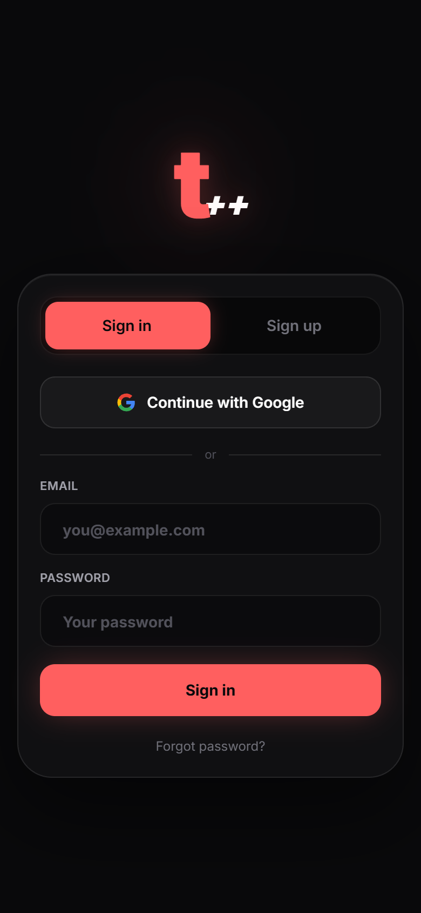
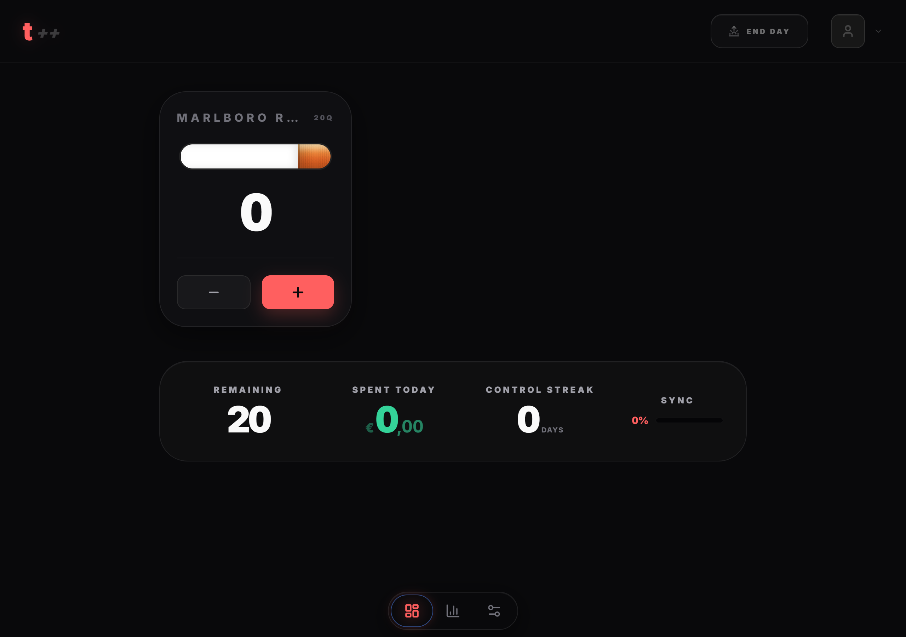
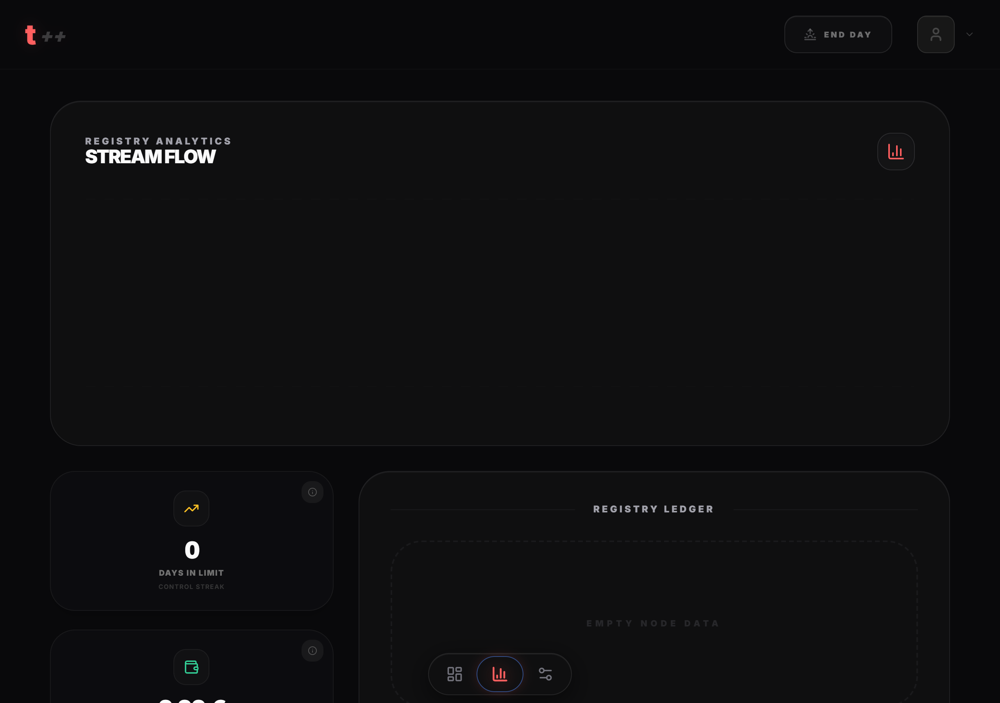
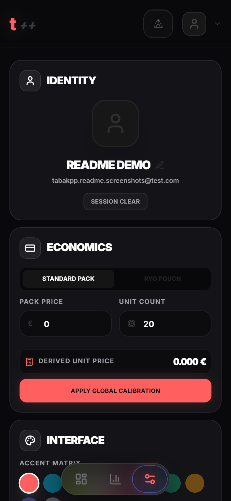

# TABAK++ (tabakpp-pwa)

A privacy-focused **Progressive Web App** for tracking tobacco and nicotine habits with instant tap-to-log entry, real-time cloud sync, and visual feedback that makes daily limits tangible—not another spreadsheet.

**Live app:** [https://tabakpp.web.app](https://tabakpp.web.app)

---

## The idea

Most habit trackers feel like chores: too many taps, generic counters, no sense of progress. **TABAK++** (T++) is built around **tracking friction**—the gap between wanting to log and actually logging.

The app treats each product you track (cigarettes, roll-your-own, pouches, etc.) as a **registry node** with its own daily limit and a dedicated gauge. One tap increments; limits turn the UI amber/red so you feel urgency before you blow past your goal. A **tracking day** can start at a custom hour (e.g. 4 AM) so “today” matches your rhythm, not midnight.

History turns raw logs into **velocity charts** and streak-style metrics (health, savings, XP-style progress). Settings hold your identity, accent color, protocols, and day-start—all synced across devices via Firebase.

---

## Screenshots

Captured from the running app (`npm run dev` + `npm run screenshots`).

| Sign-in | Track dashboard (desktop) |
|---|---|
|  |  |

| History & analytics | Settings |
|---|---|
|  |  |

---

## Features

- **One-tap logging** — Increment/decrement counters from the track grid; optional manual entries and edits in history.
- **Custom gauges** — Ring, bar, zig-zag, RYO roll, and joint-style progress visuals per tracker type.
- **Tracking day boundary** — Configurable day-start hour with live rollover.
- **Metrics banner** — Streak, savings, and health-style derived stats from your log stream.
- **Real-time sync** — Firestore listeners keep all signed-in devices in step.
- **Personalization** — Per-user accent color, avatar (Firestore-backed), and protocol templates.
- **PWA** — Installable on iOS/Android; standalone display without browser chrome.
- **Security** — Firebase App Check (reCAPTCHA v3), hardened Firestore rules, security headers on hosting.

---

## Tech stack

| Layer | Technology |
|-------|------------|
| UI | React 18, React Router 7, Tailwind CSS |
| Motion | Framer Motion |
| Charts | Recharts |
| Icons | Lucide React |
| Backend | Firebase Auth, Cloud Firestore |
| App integrity | Firebase App Check (reCAPTCHA v3) |
| Build | Vite 5 |
| PWA | vite-plugin-pwa |
| Tests | Vitest, Testing Library |
| Deploy | Firebase Hosting |

---

## Project structure

```
src/
├── api/              # Auth, Firestore registry, avatar services
├── config/           # Firebase bootstrap, App Check
├── components/       # Shared layout (Header, BottomNav) and UI primitives
├── constants/        # Routes, design tokens
├── context/          # AuthContext
├── features/         # auth, dashboard, history, settings, shared modals
├── hooks/            # useRegistry, useModalA11y
├── styles/           # globals.css, fidelity design system
└── utils/            # logic (metrics, tracking date), system helpers
```

---

## Getting started

### Prerequisites

- Node.js 18+
- A Firebase project with Auth (Email + Google) and Firestore enabled

### 1. Clone and install

```bash
git clone https://github.com/shareef01/tabakpp-pwa.git
cd tabakpp-pwa
npm install
```

### 2. Environment variables

Copy the template and fill in values from **Firebase Console → Project settings → Your apps → Web app**:

```bash
cp .env.example .env
```

| Variable | Description |
|----------|-------------|
| `VITE_FIREBASE_*` | Standard Firebase web config (API key, project ID, etc.) |
| `VITE_FIREBASE_APP_CHECK_KEY` | reCAPTCHA v3 **site key** (public) from App Check |
| `VITE_FIREBASE_APP_CHECK_DEBUG_TOKEN` | Optional; pin a debug token for local dev |

> **Secrets stay out of git.** Never commit `.env`. The reCAPTCHA **secret** key belongs only in the Firebase App Check console—not in this repo.

### 3. Run locally

```bash
npm run dev
```

For local Firestore with App Check enforcement, register a debug token (see `.env.example` and `scripts/setup-app-check.mjs`).

### 4. Test & build

```bash
npm test
npm run build
```

### 5. Deploy (optional)

```bash
firebase deploy --only hosting,firestore
```

---

## Install as PWA

**iOS (Safari):** Share → **Add to Home Screen**

**Android (Chrome):** Menu → **Install app**

---

## License

Private project. All rights reserved.
